# Capítulo 5 — Diagrama de Base de Datos (Modelo Físico Normalizado, 3FN)

> **Fuente:** extraído directamente de `database.py` → `init_db()`. Refleja el esquema
> **realmente implementado** tras los Arreglos 1–8. SGBD: **SQLite 3**. Integridad referencial
> activa en cada conexión (`PRAGMA foreign_keys = ON`).

## Resumen de tablas

| # | Tabla | Tipo | PK | Descripción |
|---|-------|------|----|-------------|
| 1 | `cat_tipo_usuario` | Catálogo | `id` | Administrador, Comprador, Vendedor |
| 2 | `cat_tipo_articulo` | Catálogo | `id` | General, Vehiculo, Inmueble, Digital, Entrada |
| 3 | `cat_tipo_subasta` | Catálogo | `id` | Inglesa, Holandesa, Sellada |
| 4 | `cat_estado_articulo` | Catálogo | `id` | Pendiente, Aprobado, Rechazado, Publicado |
| 5 | `cat_estado_subasta` | Catálogo | `id` | Activa, Finalizada, Desierta, Cancelada |
| 6 | `cat_estado_cuenta` | Catálogo | `id` | Activa, Suspendida, Cancelada |
| 7 | `cat_estado_pago` | Catálogo | `id` | Pendiente, EnVerificacion, Verificado, Vencido, Reasignado |
| 8 | `cat_condicion_articulo` | Catálogo | `id` | Nuevo, Usado, Reacondicionado |
| 9 | `usuario` | Entidad | `id_usuario` | Usuarios (3 roles) con reputación y estado de cuenta |
| 10 | `articulo` | Entidad | `id_articulo` | Artículos publicados para subasta |
| 11 | `vehiculo` | Extensión 1:1 | `id_articulo` | Atributos específicos de vehículos |
| 12 | `inmueble` | Extensión 1:1 | `id_articulo` | Atributos específicos de inmuebles |
| 13 | `validacion` | Entidad | `id_validacion` | Decisiones del admin (temporizador 30 min solo para General) |
| 14 | `subasta` | Entidad | `id_subasta` | Subastas activas/cerradas (con campos de holandesa) |
| 15 | `oferta` | Entidad | `id_oferta` | Ofertas de los compradores |
| 16 | `pago` | Entidad | `id_pago` | Pagos y comprobantes del ganador |
| 17 | `calificacion` | Entidad | `id_calificacion` | Calificaciones mutuas (1–5) |
| 18 | `notificacion` | Entidad | `id_notificacion` | Alertas internas por usuario |
| 19 | `log_admin` | Entidad | `id_log` | Auditoría de acciones administrativas |
| 20 | `lista_negra` | Entidad | `id_lista` | Correos bloqueados por fraude (RN-26) |
| 21 | `imagen_recepcion` | Entidad | `id_imagen` | Evidencia fotográfica al confirmar recepción (CU-C07) |
| 22 | `plan_pago` | Entidad | `id_plan` | Cuotas de pago a plazos (RN-27) |
| 23 | `correo_salida` | Entidad | `id_correo` | Bandeja de correos de salida (stub C10, sin SMTP) |

> **Nota:** `vehiculo` e `inmueble` no estaban en la lista pedida pero **sí existen** en el código
> como extensiones 1:1 de `articulo`; se incluyen por fidelidad al esquema real.

---

## Diagrama PlantUML (Modelo Entidad-Relación físico)

```plantuml
@startuml diagrama_bd
hide circle
skinparam linetype ortho
skinparam classFontStyle bold
skinparam shadowing false

' ───────────── CATÁLOGOS (3FN) ─────────────
entity "cat_tipo_usuario" as cat_tu {
  * id : INTEGER <<PK>>
  --
  tipo : TEXT <<UNIQUE>>
}
entity "cat_tipo_articulo" as cat_ta {
  * id : INTEGER <<PK>>
  --
  tipo : TEXT <<UNIQUE>>
}
entity "cat_tipo_subasta" as cat_ts {
  * id : INTEGER <<PK>>
  --
  tipo : TEXT <<UNIQUE>>
}
entity "cat_estado_articulo" as cat_ea {
  * id : INTEGER <<PK>>
  --
  estado : TEXT <<UNIQUE>>
}
entity "cat_estado_subasta" as cat_es {
  * id : INTEGER <<PK>>
  --
  estado : TEXT <<UNIQUE>>
}
entity "cat_estado_cuenta" as cat_ec {
  * id : INTEGER <<PK>>
  --
  estado : TEXT <<UNIQUE>>
}
entity "cat_estado_pago" as cat_ep {
  * id : INTEGER <<PK>>
  --
  estado : TEXT <<UNIQUE>>
}
entity "cat_condicion_articulo" as cat_ca {
  * id : INTEGER <<PK>>
  --
  condicion : TEXT <<UNIQUE>>
}

' ───────────── ENTIDADES PRINCIPALES ─────────────
entity "usuario" as usuario {
  * id_usuario : INTEGER <<PK>>
  --
  nombre : TEXT
  correo : TEXT <<UNIQUE>>
  password_hash : TEXT
  * id_tipo : INTEGER <<FK cat_tipo_usuario>>
  * id_estado : INTEGER <<FK cat_estado_cuenta>>
  reputacion : REAL
  total_cal : INTEGER
  fecha_registro : TEXT
  terminos_ok : INTEGER
}

entity "articulo" as articulo {
  * id_articulo : INTEGER <<PK>>
  --
  titulo : TEXT
  descripcion : TEXT
  * id_tipo : INTEGER <<FK cat_tipo_articulo>>
  * id_condicion : INTEGER <<FK cat_condicion_articulo>>
  ubicacion : TEXT
  * id_vendedor : INTEGER <<FK usuario>>
  * id_estado : INTEGER <<FK cat_estado_articulo>>
  fecha_registro : TEXT
  imagen_path : TEXT
}

entity "vehiculo" as vehiculo {
  * id_articulo : INTEGER <<PK,FK articulo>>
  --
  marca : TEXT
  modelo : TEXT
  anio : INTEGER
  kilometraje : INTEGER
  num_serie : TEXT
  doc_path : TEXT
}

entity "inmueble" as inmueble {
  * id_articulo : INTEGER <<PK,FK articulo>>
  --
  tipo_propiedad : TEXT
  superficie_terreno : REAL
  superficie_construida : REAL
  num_habitaciones : INTEGER
  ubicacion_detallada : TEXT
  doc_path : TEXT
}

entity "validacion" as validacion {
  * id_validacion : INTEGER <<PK>>
  --
  * id_articulo : INTEGER <<FK articulo>>
  id_admin : INTEGER <<FK usuario>>
  decision : TEXT
  comentario : TEXT
  fecha_limite : TEXT
  fecha_decision : TEXT
  extendida : INTEGER
}

entity "subasta" as subasta {
  * id_subasta : INTEGER <<PK>>
  --
  * id_articulo : INTEGER <<FK articulo>>
  * id_tipo : INTEGER <<FK cat_tipo_subasta>>
  precio_base : REAL
  precio_actual : REAL
  incremento_min : REAL
  precio_piso : REAL
  decremento_hora : REAL
  fecha_inicio : TEXT
  fecha_fin : TEXT
  * id_estado : INTEGER <<FK cat_estado_subasta>>
  id_ganador : INTEGER <<FK usuario>>
  motivo_cancel : TEXT
}

entity "oferta" as oferta {
  * id_oferta : INTEGER <<PK>>
  --
  * id_subasta : INTEGER <<FK subasta>>
  * id_comprador : INTEGER <<FK usuario>>
  monto : REAL
  fecha_oferta : TEXT
  es_sellada : INTEGER
}

entity "pago" as pago {
  * id_pago : INTEGER <<PK>>
  --
  * id_subasta : INTEGER <<FK subasta>>
  * id_comprador : INTEGER <<FK usuario>>
  monto : REAL
  * id_estado : INTEGER <<FK cat_estado_pago>>
  comprobante : TEXT
  fecha_limite : TEXT
  fecha_pago : TEXT
  es_segundo : INTEGER
}

entity "plan_pago" as plan_pago {
  * id_plan : INTEGER <<PK>>
  --
  * id_pago : INTEGER <<FK pago>>
  num_cuota : INTEGER
  monto_cuota : REAL
  fecha_vencimiento : TEXT
  * id_estado : INTEGER <<FK cat_estado_pago>>
}

entity "calificacion" as calificacion {
  * id_calificacion : INTEGER <<PK>>
  --
  * id_subasta : INTEGER <<FK subasta>>
  * id_calificador : INTEGER <<FK usuario>>
  * id_calificado : INTEGER <<FK usuario>>
  puntuacion : INTEGER <<CHECK 1..5>>
  comentario : TEXT
  fecha : TEXT
}

entity "imagen_recepcion" as imagen_recepcion {
  * id_imagen : INTEGER <<PK>>
  --
  * id_pago : INTEGER <<FK pago>>
  ruta : TEXT
  fecha : TEXT
}

entity "notificacion" as notificacion {
  * id_notificacion : INTEGER <<PK>>
  --
  * id_usuario : INTEGER <<FK usuario>>
  mensaje : TEXT
  tipo : TEXT
  leida : INTEGER
  fecha : TEXT
  id_ref : INTEGER
}

entity "correo_salida" as correo_salida {
  * id_correo : INTEGER <<PK>>
  --
  * id_destinatario : INTEGER <<FK usuario>>
  correo_destino : TEXT
  asunto : TEXT
  cuerpo : TEXT
  fecha : TEXT
  enviado : INTEGER
}

entity "lista_negra" as lista_negra {
  * id_lista : INTEGER <<PK>>
  --
  correo : TEXT <<UNIQUE>>
  motivo : TEXT
  fecha : TEXT
}

entity "log_admin" as log_admin {
  * id_log : INTEGER <<PK>>
  --
  * id_admin : INTEGER <<FK usuario>>
  accion : TEXT
  detalle : TEXT
  fecha : TEXT
}

' ───────────── RELACIONES CATÁLOGO → ENTIDAD (1:N) ─────────────
cat_tu  ||--o{ usuario      : "id_tipo"
cat_ec  ||--o{ usuario      : "id_estado"
cat_ta  ||--o{ articulo     : "id_tipo"
cat_ca  ||--o{ articulo     : "id_condicion"
cat_ea  ||--o{ articulo     : "id_estado"
cat_ts  ||--o{ subasta      : "id_tipo"
cat_es  ||--o{ subasta      : "id_estado"
cat_ep  ||--o{ pago         : "id_estado"
cat_ep  ||--o{ plan_pago    : "id_estado"

' ───────────── RELACIONES ENTIDAD → ENTIDAD ─────────────
usuario  ||--o{ articulo     : "vende (id_vendedor)"
articulo ||--|| vehiculo     : "extiende (1:1)"
articulo ||--|| inmueble     : "extiende (1:1)"
articulo ||--o{ validacion   : "se valida"
usuario  ||--o{ validacion   : "valida (id_admin)"
articulo ||--|| subasta      : "se subasta (1:1)"
subasta  ||--o{ oferta       : "recibe"
usuario  ||--o{ oferta       : "puja (id_comprador)"
subasta  ||--o{ pago         : "genera"
usuario  ||--o{ pago         : "paga (id_comprador)"
usuario  ||--o{ subasta      : "gana (id_ganador)"
pago     ||--o{ plan_pago    : "se divide en cuotas"
pago     ||--o{ imagen_recepcion : "evidencia de"
subasta  ||--o{ calificacion : "se califica"
usuario  ||--o{ calificacion : "emite (id_calificador)"
usuario  ||--o{ calificacion : "recibe (id_calificado)"
usuario  ||--o{ notificacion : "recibe"
usuario  ||--o{ correo_salida : "destinatario (id_destinatario)"
usuario  ||--o{ log_admin    : "registra (id_admin)"

@enduml
```

---

## Relaciones muchos-a-muchos (N:M) resueltas con entidades asociativas

El modelo está en 3FN; las relaciones N:M se resuelven con tablas intermedias:

| Relación lógica N:M | Entidad que la resuelve | Atributos propios de la relación |
|----------------------|--------------------------|-----------------------------------|
| `usuario` (comprador) ⇄ `subasta` — *un comprador puja en muchas subastas; una subasta recibe pujas de muchos compradores* | **`oferta`** | `monto`, `fecha_oferta`, `es_sellada` |
| `usuario` (comprador) ⇄ `subasta` — *participación de pago del ganador* | **`pago`** | `monto`, `id_estado`, `comprobante`, `fecha_limite`, `es_segundo` |
| `usuario` (calificador) ⇄ `usuario` (calificado) — *calificación tras la transacción* | **`calificacion`** | `puntuacion`, `comentario` (ligada a `id_subasta`) |

## Relaciones uno-a-uno (1:1)

| Tabla base | Extensión | Condición |
|-----------|-----------|-----------|
| `articulo` | `vehiculo` | Solo cuando `articulo.id_tipo = 2` (Vehículo) |
| `articulo` | `inmueble` | Solo cuando `articulo.id_tipo = 3` (Inmueble) |
| `articulo` | `subasta` | Una subasta por artículo (creada en `publicar_articulo()`) |

## Cardinalidades 1:N destacadas

- `pago` **1:N** `plan_pago` — un pago a plazos se divide en N cuotas (3, 6 o 12).
- `pago` **1:N** `imagen_recepcion` — una recepción puede tener varias imágenes de evidencia.
- `usuario` **1:N** `correo_salida` — bandeja de correos por destinatario.

## Notas de diseño (extraídas del código)

- **Normalización 3FN:** todo valor enumerado (tipos, estados, condiciones) vive en una tabla `cat_*` y se referencia por `id`.
- **Campos de subasta holandesa (RN-09):** `precio_piso` y `decremento_hora` son NULL para subastas que no son holandesas; `precio_actual = max(precio_piso, precio_base − decremento_hora × horas_transcurridas)`.
- **Desnormalización intencional (caché de rendimiento):**
  - `subasta.precio_actual` → cachea la puja vigente; se actualiza en `realizar_oferta()` y en `verificar_decremento_holandesa()`.
  - `usuario.reputacion` y `usuario.total_cal` → cachean `AVG`/`COUNT` de `calificacion`; se actualizan en `confirmar_recepcion()`.
- **Integridad referencial:** `PRAGMA foreign_keys = ON` en cada conexión (`get_db()`).
- **Restricción CHECK:** `calificacion.puntuacion BETWEEN 1 AND 5`.
- **Claves naturales únicas:** `usuario.correo`, `lista_negra.correo` y el campo `tipo`/`estado`/`condicion` de cada catálogo.
