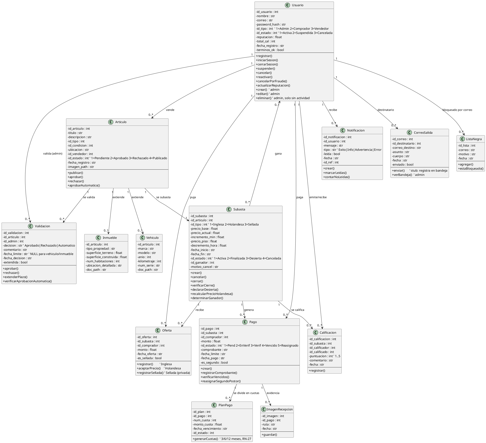

# Capítulo 5 — Diagrama de Clases

> **Fuente:** los **atributos** se derivan del esquema real (`database.py`) y los **métodos** de
> las funciones/rutas implementadas en `app.py`. Al final hay una tabla de trazabilidad
> método → función real. El sistema no usa ORM (SQL directo), por lo que el diagrama es un
> **modelo conceptual** de las entidades del dominio, no una transcripción de clases Python.

## Diagrama PlantUML

---

## Trazabilidad: método de clase → función real en `app.py`

| Clase.método | Función / ruta real | Notas |
|--------------|---------------------|-------|
| `Usuario.registrar()` | `registro()` | Valida términos, longitud ≥8, correo único y lista negra (RN-26) |
| `Usuario.iniciarSesion()` | `login()` | Verifica hash y estado de cuenta |
| `Usuario.cerrarSesion()` | `logout()` | `session.clear()` |
| `Usuario.suspender()` / `cancelar()` / `reactivar()` | `admin_gestionar_usuario()` | Acciones Suspender/Cancelar/Reactivar |
| `Usuario.cancelarPorFraude()` | `admin_gestionar_usuario()` (acción `CancelarFraude`) | Lista negra + cancela subastas + suspende (RN-26) |
| `Usuario.actualizarReputacion()` | `confirmar_recepcion()` | `AVG`/`COUNT` de calificaciones |
| `Usuario.crear()` / `editar()` / `eliminar()` | `admin_nuevo_usuario()` / `admin_editar_usuario()` / `admin_eliminar_usuario()` | Eliminar solo si no hay actividad |
| `Articulo.publicar()` | `publicar_articulo()` | Valida duración por tipo (RN-22/23/24) |
| `Articulo.aprobar()` / `rechazar()` | `admin_validar()` | Rechazo exige motivo |
| `Articulo.aprobarAutomatico()` | `verificar_aprobacion_automatica()` | Solo General a los 30 min (RN-02) |
| `Validacion.extenderPlazo()` | `admin_validar()` (acción `Extender`) | +30 min, marca `extendida` |
| `Validacion.verificarAprobacionAutomatica()` | `verificar_aprobacion_automatica()` | Barrido |
| `Subasta.crear()` | `publicar_articulo()` | Inserta también `precio_piso`/`decremento_hora` si es holandesa |
| `Subasta.cancelar()` | `admin_cancelar_subasta()` | Motivo obligatorio (RN-05/CU-A06) |
| `Subasta.cerrar()` | `cerrar_subasta_con_ganador()` | Fija ganador + crea `pago` con plazo (RN-13/14/15/16) |
| `Subasta.verificarCierre()` | `verificar_cierre_subastas()` | Cierra por `fecha_fin` vencida (RN-13) |
| `Subasta.declararDesierta()` | `verificar_cierre_subastas()` / `verificar_pagos_vencidos()` | 0 ofertas o 2º no paga (RN-18) |
| `Subasta.recalcularPrecioHolandesa()` | `verificar_decremento_holandesa()` | Descenso horario (RN-09) |
| `Subasta.determinarGanador()` | `verificar_cierre_subastas()` | `MAX(monto)`, desempate por `fecha_oferta ASC` |
| `Oferta.registrar()` | `realizar_oferta()` rama Inglesa | Incremento mínimo (RN-08) |
| `Oferta.aceptarPrecio()` | `realizar_oferta()` rama Holandesa | Recalcula precio en servidor + cierre inmediato (RN-09) |
| `Oferta.registrarSellada()` | `realizar_oferta()` rama Sellada | Una por usuario, privada (RN-10) |
| `Pago.crear()` | `cerrar_subasta_con_ganador()` | Plazo según tipo de artículo |
| `Pago.registrarComprobante()` | `realizar_pago()` | Sube comprobante, estado→EnVerificacion |
| `Pago.verificarVencidos()` | `verificar_pagos_vencidos()` | Marca Vencido (RN-17) |
| `Pago.reasignarSegundoPostor()` | `verificar_pagos_vencidos()` | Nuevo pago al 2º postor (RN-17/18) |
| `PlanPago.generarCuotas()` | `realizar_pago()` | 3/6/12 cuotas si monto>$10k y no inmueble (RN-27) |
| `Calificacion.registrar()` | `confirmar_recepcion()` | Puntuación 1–5 |
| `ImagenRecepcion.guardar()` | `confirmar_recepcion()` | ≥1 imagen JPG/PNG ≤5MB obligatoria |
| `Notificacion.crear()` | `notificar()` | Helper interno |
| `Notificacion.marcarLeidas()` | `notificaciones()` | Marca todas leídas al abrir |
| `Notificacion.contarNoLeidas()` | `notificaciones_count()` | API JSON (poll navbar) |
| `CorreoSalida.enviar()` | `enviar_correo()` | Stub: registra en `correo_salida` (sin SMTP) |
| `CorreoSalida.verBandeja()` | `admin_correos()` | Vista admin |
| `ListaNegra.agregar()` | `admin_gestionar_usuario()` (CancelarFraude) | `INSERT OR IGNORE` |
| `ListaNegra.estaBloqueado()` | `registro()` | Bloquea correo en lista negra (ERR-12) |
